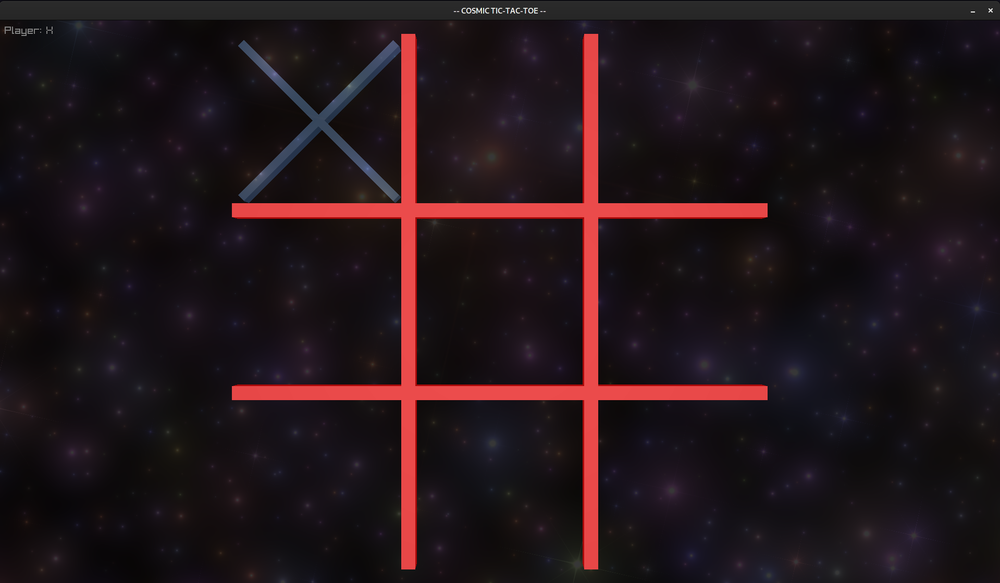

# Comsic Tic-Tac-Toe

This is a simple program for learning purposes.

Goals:

* Play around and learn some more about the [Odin programming language](https://odin-lang.org/)
* Play with the [Raylib](https://www.raylib.com/) game programming library
* Learn more about OpenGL shaders

For me, personally, this project has been a lot of fun to develop.

## Setup
To use this you will need:

* Odin
* A library build of [stb](https://github.com/nothings/stb)
* OpenGL build tools

### Odin (Arch-Linux-only instructions below)
I developed everything under (Arch-)Linux.  You can try to install Odin using one of the AUR 
packages:

* `aur/odin`
* `aur/odin-dev-bin`
* `aur/odin-git`

However, I just installed LLVM+CLang directly and built Odin from source by cloning the repo:

* https://github.com/odin-lang/Odin

Since Arch is rocking LLVM-13 as of the time of this writing you will need to do some hackery
on the `Makefile` to build:

```diff
diff --git a/Makefile b/Makefile
index d3d3c6a2..b3f54ad8 100644
--- a/Makefile
+++ b/Makefile
@@ -42,16 +42,16 @@ ifeq ($(OS), Darwin)
     LDFLAGS:=$(LDFLAGS) -lLLVM-C
 endif
 ifeq ($(OS), Linux)
-    LLVM_CONFIG=llvm-config-11
-    ifneq ($(shell which llvm-config-11 2>/dev/null),)
-        LLVM_CONFIG=llvm-config-11
-    else ifneq ($(shell which llvm-config-11-64 2>/dev/null),)
-        LLVM_CONFIG=llvm-config-11-64
+    LLVM_CONFIG=llvm-config-13
+    ifneq ($(shell which llvm-config-13 2>/dev/null),)
+        LLVM_CONFIG=llvm-config-13
+    else ifneq ($(shell which llvm-config-13-64 2>/dev/null),)
+        LLVM_CONFIG=llvm-config-13-64
     else
-        ifneq ($(shell llvm-config --version | grep '^11\.'),)
+        ifneq ($(shell llvm-config --version | grep '^13\.'),)
             LLVM_CONFIG=llvm-config
         else
-            $(error "Requirement: llvm-config must be version 11")
+            $(error "Requirement: llvm-config must be version 13")
         endif
     endif
```

With the above you should be able to build Odin:

```bash
$ make
clang src/main.cpp src/libtommath.cpp -Wno-switch -Wno-macro-redefined -Wno-unused-value -std=c++14 -DGIT_SHA=\"38725fc0\" -DODIN_VERSION_RAW=\"dev-2022-01\" -I/usr/include -std=c++14   -fno-exceptions -D_GNU_SOURCE -D__STDC_CONSTANT_MACROS -D__STDC_FORMAT_MACROS -D__STDC_LIMIT_MACROS -L/usr/lib  -g -pthread -ldl -lm -lstdc++ -lLLVM-13 -o odin
```

### Build the [STB](https://github.com/nothings/stb) image library

1. Clone [stb](https://github.com/nothings/stb)
2. Crete a file: `stb_image.c` with this in it:

```c
#define STB_IMAGE_IMPLEMENTATION
#include "stb_image.h"
```

3. Build the library we need:

```bash
$ gcc -c -o stb_image.o stb_image.c
$ ar rcs libstb_image.a stb_image.o
```

### OpenGL build tools

I just did a `yay -Sy vulkan-devel` which should bring in everything you need.

### Build Cosmic Tic-Tac-Toe

Now, you will need to edit the `build.sh` file to make sure that you use the path to where you have
built [Odin](https://odin-lang.org/) and the [stb](https://github.com/nothings/stb) image library:

```bash
# Edit the line that looks like this:
<path to where you cloned and built Odin>/odin build tic-tac-toe.odin -vet -debug -extra-linker-flags:'<path to where you built the libstb_image.a file>/libstb_image.a'
```

After this is all set up building the program should be as easy as:

```bash
$ ./build.sh && ./tic-tac-toe
```

If you see a window that looks like:



Then WOO HOO!

If not: big brain time, and we wish you luck!  Better yet: send a PR to help folks out!

## Playing the game

This is still a work in progress, so everything is subject to change.  And yes, there are bugs!

At the moment everything is keyboard driven:

* `Arrow-keys`: move the piece around
* `SPACE`: sets your piece and changes the piece
* `Q`: Quits the game any time

When the game is over:

* `R`: Starts a new game

## TODO:

* Bug fixes
* Add some sounds
* Add mouse support
* Some more bling
